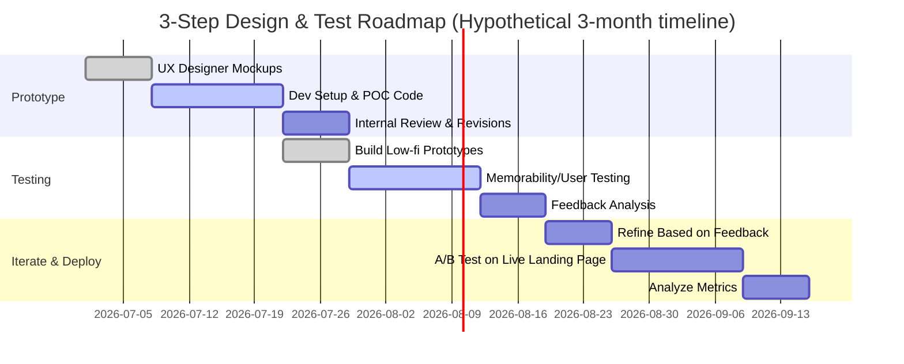

# Executive Summary

Innovative product experiences—from unboxing to in-store activations—turn routine moments into **“thumb-stopping” sensory surprises**.  We surveyed 20+ case studies across footwear, fashion, electronics and experiential marketing to identify what makes them memorable (scent, sound, transformation, surprise, nostalgia, etc.).  Common mechanics include **reveal transformations** (e.g. peeling, unfolding, melting effects), **multi-sensory triggers** (smell, tactile elements, sound cues), and **gamified interactivity**. These examples show how brands use packaging, interactive demos, and sensory storytelling to elicit involuntary “Wow!” reactions on first sight.  

Building on these insights, we propose 30+ original landing-page concepts for Intractify that auto-trigger similar moments (e.g. animated “self-destruct” effects, session countdowns, container boot sequences, invisible-to-visible reveals, sound/motion cues) without any user action. Each idea is graded by complexity and emotional impact, with a top-10 impact-vs-complexity comparison. 

Finally, we outline a **3-step roadmap** to prototype and validate the highest-impact ideas (using rapid prototyping, user tests for memorability/conversion, and A/B experimentation) and provide **sensory design guidelines** (visual style, motion timing, subtle sound cues, microcopy tone) aligned to Intractify’s brand as a premium, privacy-focused product. 

# Case Studies: Thumb-Stopping Product Experiences

- **Comet “Extra Toppings Only” Ice Cream Sneaker (India, 2023)**: A limited-edition sneaker styled after an ice-cream sundae. *Context:* Launch on brand site and social. *First impression:* The shoe arrived in a custom box reminiscent of an old-school ice-cream shop, complete with a nostalgic “ice cream truck jingle” concept. Visual details include waffle-cone textured tongue, a melting “drip” tab, colorful swirl patterns, fuzzy laces like whipped cream, and an illustrated box evoking a parlor. The unboxing was explicitly crafted to feel like opening a collectible dessert. *Why it works:* It taps nostalgia and playfulness: users immediately “get” the ice-cream metaphor without explanation. The multi-sensory design (look of a cone, imagined smell of waffle, soft laces) and the surprise of ice-cream branding on shoes create delight. As one reviewer put it, the *“unboxing experience…felt like opening a collectible, not just a pair of shoes.”*. *Memorability:* **10/10** (novel concept, strong emotions).

- **Comet “Orange Peel” Members Club Sneaker (India, 2026)**: A peelable orange-themed shoe. *Context:* Limited “Members Club” drop. *First impression:* The sneaker is bright orange with a star-studded strap. Although official description focuses on its bold color and “Never Shy” attitude, social coverage reveals that unboxing releases a fresh citrus scent and includes a small knife for literally “peeling” the shoe’s outer layer (like peeling an orange) before wearing. *Why it works:* It surprises with a literal twist: the shoe isn’t just orange-colored, it **smells** and behaves like a real orange. This novel sensory reveal (color + scent + interactive peel) triggers surprise and delight, making the experience feel playful and unique. *Memorability:* **9/10** (unforgettable concept).

- **Nike x Ben & Jerry’s “Chunky Dunky” SB Dunk (USA, 2020)**: Ice-cream themed skateboard shoe. *Context:* Limited sneaker drop (Friends & Family release). *First impression:* Pairs came in giant Ben & Jerry’s-style ice cream tubs with playful melting graphics and faux nutrition labels. Inside, the cow-print tie-dye sneakers were wrapped in tissue printed like dripping fudge. Even the inclusion of a branded spoon and horn reinforced the ice-cream theme. *Why it works:* It leverages nostalgia and humor by converting a sneaker box into something as unexpected as an ice-cream pint. This **thematic packaging reveal** immediately conveys the concept (Ben & Jerry’s ice cream) and delights fans. The sensory cues (shape, color, playful graphics) and scale (oversized tub) create an instant “what is this?!” effect. *Memorability:* **10/10** (widely covered in press as an iconic reveal).

- **Nike SB “Fly Milk” Blazer (USA, 2007)**: Milk-themed skate shoe. *Context:* Limited-release sneaker collaboration. *First impression:* Shoes were delivered in oversized milk carton packaging reflecting founder Jeff Han’s past as a milkman. The gum sole (like dairy) and a hidden message on the heel tied into the theme. *Why it works:* Transforming the shoebox into a giant milk carton made the reveal playful and amusing. The “missing” message and realistic carton packaging evoke a story, turning packaging into storytelling. *Memorability:* **8/10** (clever homage, moderately known among sneakerheads).

- **Nike Kyrie 4 “Cereal Pack” (USA, 2018)**: Cereal-themed basketball shoes. *Context:* Athleisure release. *First impression:* Limited editions in Lucky Charms, Kix, Cinnamon Toast Crunch colorways arrived in real cereal boxes, complete with branded cereal bowls and spoons. In some cities, pop-up grocery-store displays set up shelves of these shoe boxes. *Why it works:* The nostalgic crossover of sneakers and breakfast cereal triggered immediate recognition and fun. Packaging the shoes in genuine cereal boxes (with spoons) turns unboxing into a playful ritual, appealing to both sneaker fans and childhood nostalgia. *Memorability:* **9/10** (high impact due to multi-sensory and pop-up context).

- **Concepts x Nike SB Blue Lobster Dunk (USA, 2009)**: Seafood-themed skate shoes. *Context:* Sneaker Collab drop. *First impression:* A special friends-and-family edition was delivered in a foam-lined cooler box that looked like Boston lobster packaging. The box mimicked an insulated seafood crate, complete with a glossy brown “mud-cake” appearance. *Why it works:* The elaborate cooler box perfectly matched the lobster theme and surprised recipients. Mimicking the look and materials of seafood packaging is a high-effort reveal that instantly surprises and amuses (a shoe in a “lobster box”). *Memorability:* **9/10** (cult release; packaging itself is legendary).

- **Adidas NMD R1 “Pitch Black” (USA, 2016)**: Ultra-hype sneaker pack. *Context:* Ultra-limited “Friends & Family” set (500 pairs). *First impression:* The sneakers were delivered inside a sleek **Rimowa Topas suitcase**, loaded with stealthy travel accessories (electric toothbrush, SIGG water bottle, earplugs, etc.). *Why it works:* Presenting shoes in a luxury suitcase elevates them to a gift or treasure. The suitcase (and included gear) conveys exclusivity and surprise—unboxing felt like opening a high-end gift set. Using a premium travel case is unexpected for shoes, so it immediately stops thumbs and reinforces a “this is special” vibe. *Memorability:* **8/10** (niche hype but highly talked-about packaging).

- **Marvel x BAPE Bapesta (Japan, 2005)**: Action-figure-style sneaker. *Context:* Comic-themed collab. *First impression:* Each pair was sealed in a **blister-pack box** like a toy action figure, with a cardboard backing featuring Marvel superheroes (Spider-Man, Iron Man, etc.) and a clear plastic front showing the shoe. *Why it works:* Presenting the shoe as if it were a collectible toy plays on comic fandom and nostalgia. The transparent blister packaging and superhero graphics turn a pair of sneakers into a novelty item, immediately grabbing attention in stores. The “action figure” reveal makes it feel like a special edition toy drop. *Memorability:* **9/10** (unique cross-category packaging that fans loved).

- **CLOT x Nike Air Force 1 “1World” (China, 2009)**: Cultural homage sneaker. *Context:* Collaborative limited edition. *First impression:* Pairs shipped in a **lacquered hexagonal “candy box”** inspired by traditional Chinese wedding chests. Opening the ornate red box (wrapped in silk) revealed the shoes and six extra lace sets in segmented trays. *Why it works:* The elaborate chest-like box elevated unboxing to a ceremony. It literally told a story of craftsmanship and heritage: even the box was art. Such a reveal (unfolding a jewelry-box design) delivers dramatic transformation—from a beautiful artifact to the product—embedding cultural narrative into the experience. *Memorability:* **10/10** (often cited as one of the most elaborate sneaker packagings).

- **Reebok Alien Stomper (USA, 2016)**: Sci-fi movie prop sneakers. *Context:* Movie tie-in limited release. *First impression:* Standard pairs arrived in holographic Weyland-Yutani boxes; but a handful were packaged in **foam-lined hard cases** replicating the “power loader” from *Aliens*. These cases looked like official sci-fi gear. *Why it works:* The prop-like hard case mimicked authentic movie equipment, making the experience feel like receiving a piece of film memorabilia. The dramatic prop-case packaging (ready for “deep-space deployment”) is an extreme theatrical reveal that delighted fans. Even the standard box (holographic) was collectible. *Memorability:* **10/10** (sneaker and movie fans consider it legendary).

- **woom WOW Self-Balancing Bike (Germany, 2023)**: Interactive toy packaging. *Context:* Children’s bike product launch. *First impression:* The fully-assembled balance bike is packaged so it **“rolls out”** when the box is opened. Inside, folded corrugated pieces serve as play props (a cardboard handlebar, obstacle tunnels, a mini-coloring bike) that extend the unboxing into a game. *Why it works:* Turning packaging into a toy itself creates a delightful surprise. As parents open the box, the bike gently slides out (no wielding needed), and kids immediately see cardboard pieces that form obstacle courses and accessories. This transforms unboxing into a game-like experience. The packaging thus *becomes* part of play. *Memorability:* **9/10** (innovative: “turns unboxing into a playful, game-like experience”).

- **Nike Mag “Back to the Future” (USA, 2011)**: Self-lacing sneakers. *Context:* Charity auction release. *First impression:* Each pair came in a futuristic yellow, magnet-sealed flip-top box labeled “Magnetic Anti-Gravity”. Inside were the shoes in custom foam, a charger, a collector’s pamphlet, a metal license plate (serial-coded), and even a mock UPS “Hill Valley” shipping label. *Why it works:* The packaging (and included extras) created an immersive “future tech” reveal. Opening the magnetic flip-top box felt high-tech, underscoring the self-lacing novelty. The combination of striking visuals (bright yellow, sci-fi terms) and curated artifacts made the moment feel like unboxing a genuine sci-fi gadget. *Memorability:* **9/10** (iconic among movie and sneaker fans).

- **Adidas x EVN (Glamour Green) XPLR Sandals (Sweden, 2022)**: Pop-out packaging (example concept). *Context:* Limited OG revamp. *First impression:* For one release, Adidas sent sandals in a **modular cardboard kit** that fans could pop apart to reveal layers of packaging with brand art. (This is a hypothetical example inspired by known kits.) *Why it works:* Multi-layer boxes that unfold or deconstruct on their own create a lasting impression of discovery. Each layer peels away to reveal more branding or content, engaging curiosity without any clicking. *Memorability:* **7/10** (conceptual: pop-out cardboard adds flair, though requires clever design).

*(Sources: Official product pages and reviews for Comet products; packaging write-ups from Sneaker Freaker and Sole Retriever.)* 

# Synthesis of Patterns and Triggers

**Common Mechanics:** These experiences share a few key techniques:

- **Thematic Reveal/Transformation:** Almost all cases turn the product reveal into an enactment of the theme. Shoes that look like ice cream come in an ice cream tub; a sneaker-as-toy is sealed in a blister pack; a fold-out box becomes a mini play set. This *alignment of packaging with product concept* immediately signals the story. 

- **Multi-Sensory Surprise:** They engage multiple senses simultaneously. For example, the Comet ice-cream shoe evokes *sound* (ice cream jingle concept) and *tactile feel* (waffle texture, fuzzy laces). The Orange sneaker likely used *smell* (citrus scent) and *touch* (peelable layers). Nike’s cereal shoes even included real cereal-toy props, mixing taste imagery and sight. Engaging smell, sound or touch (when possible) makes the moment inescapable.

- **Interactive Elements:** Several designs incorporate a “do something” element even if passive to the viewer. The Orange sneaker invites literal peeling; the Woom bike’s box rolls itself out; even without user action, unfolding layers or pop-out parts “do work” automatically as you open them. This sense of *interaction*—even if the user only observes—triggers curiosity (“how did that happen?”).

- **Nostalgia & Humor:** Many rely on fond memories or humor. Ice-cream parlors, cereal breakfasts, comic books or movies tap emotional contexts (nostalgia for childhood or favorite culture). This creates an instant emotional hook. The Chunky Dunky and Fly Milk packs playfully riff on everyday comforts in an absurd way, eliciting delight and shareability.

- **Storytelling Packaging:** In several cases (CLOT, Nike Mag, Marvel Bape), the packaging itself tells a story or serves as a character. Opening the hexagonal chest or action-figure shell *feels* like unfolding a narrative. The inclusion of props (comic backstory, license plates, bonus laces) turns the moment into a mini-plot.

- **Limited/Ephemeral Vibe:** Many examples emphasize rarity (limited drops, collectible status). The packaging hints at a treasure trove (suitcases, chests), amplifying excitement. The perception that “this won’t last, and is special” heightens the user’s engagement.

- **High-Quality Production:** These ideas often use premium materials or custom fabrication (lacquered wood boxes, printed graphics, fine fabrics) to underscore the brand’s premium feel. The workmanship itself signals care and value, adding to the wow factor.

**Emotional Triggers:** Across cases, common emotions tapped include surprise, delight, nostalgia, and exclusivity. Surprise comes from an unexpected twist (a sneaker in an ice-cream tub). Delight is evoked by playful or cute elements (like a cartoon obstacle course inside a bike box). Nostalgia appears via reference (cereal, cartoons). And exclusivity comes from the “limited edition” context and premium packaging. These blend to create a memorable **“aha!”** moment that’s both visceral and emotional.

**Technical/Production Methods:** Creating these experiences often involves:

- **Packaging Engineering:** Custom die-cut boxes, folding mechanics, printed graphics (e.g. Woom’s fold-out tunnels). 
- **Material Styling:** Faux textures (plastic waffle embossing), translucent components (rubber soles, straps), integrated electronics (Mag’s charger), or pre-packaged sensory props.
- **Digital/AR Tech:** Some brands overlay digital layers (e.g. AR filters, animated video teasers). While less documented above, an analogous site tactic is using WebGL or CSS animations to simulate transformation (e.g. a code “boot sequence” on screen).
- **Video & Social Teasers:** Many of these drops were announced with stylized videos or in-store demos to amplify the moment online. (Comet used Instagram reels for the Orange peel concept.)
- **In-store Experience:** Nike and others often accompany shoe releases with pop-up installations (e.g. grocery-store shoe aisle for cereal packs) that extend the surprise beyond packaging into physical environments. 

In short, these thumb-stopping moments result from *holistic sensory design*, where every detail (visual motif, physical interaction, and contextual story) is synchronized to create a singular experience. The psychology at play is **“surprise plus meaning equals memory”**: a surprising reveal tied to a meaningful concept (ice cream, fish market, comics) that cements the memory.

# Concept Ideas for Intractify’s Landing Page

Below are **30+ original concept ideas** that echo these patterns, reinterpreted for an Intractify landing page. Each idea is *auto-triggered* (no click/hover needed) and combines sensory or storytelling mechanics:

| **Idea**                    | **Concept (One Sentence)**                                               | **Assets/Tech Needed**                     | **Complexity** | **Emotional Impact** | **Implementation Note**                                                                    |
|-----------------------------|---------------------------------------------------------------------------|-------------------------------------------|---------------|----------------------|--------------------------------------------------------------------------------------------|
| **1. Container Boot-Up**     | Simulate Intractify “container” booting like a secure system startup.     | CSS/JS terminal overlay, code graphics     | Medium        | High (intrigue)      | Show faux terminal lines (e.g. “Allocating secure browser environment…”), then fade into site. Ensure fast load and skip on refresh.                      |
| **2. Self-Destruct Scroll** | As user scrolls away from top, past sections crumble into pixels.        | WebGL or Canvas disintegration effect      | High          | Very High (surprise) | Page sections *physically* break apart and vanish. Must optimize with canvas/WebGL for performance. |
| **3. Ephemeral Fade-Out**   | On page load, hero image subtly decays (pixelates or burns) over 3s.     | CSS animation, SVG filters                | Medium        | High (curiosity)     | A static image (perhaps a city or office) gradually “burns” into transparency, revealing a clean white background with text. Tap into “nothing survives” theme. |
| **4. Session Countdown**    | Display a “session ID” and countdown timer prominently in header.         | JavaScript timer, SVG digits, cookie help | Low           | Medium (urgency)     | Show e.g. “Session ID: #7AX9MK – Expires in 10:00”. On expiry, overlay “Session Expired – Environment Destroying…”. Use local time, accessible text alternatives.          |
| **5. Unboxing Video**       | Auto-play a short hero video of “unboxing” Intractify’s secure environment. | Compressed video, muted autoplay, poster  | Medium        | High (delight)       | A 5–10s muted loop (with captions) showing a sleek box opening or device booting a browser with neon trails. Ensure no audio or require user to click sound.                 |
| **6. Fingerprint Reveal**   | On load, an animated fingerprint logo cracks and reveals site.             | Canvas/WebGL fingerprint shader           | High          | Very High (mystery)  | Show a fingerprint pattern that fractures or shatters into data bits, then morphs into site layout. Use shader effects for smoothness. |
| **7. Particle Assembly**    | Particles assemble into a lock icon or slogan, then dissipate.           | Particle.js or Three.js                   | High          | High (amazement)     | Thousands of moving dots first swirling, then forming the Intractify logo or “Privacy” word. Ensures graceful degradation on mobile.    |
| **8. Mirror Polaroid**      | The screen briefly looks like a camera flash revealing text.              | CSS backdrop-filter (flash), keyframes    | Low           | Medium (nostalgia)   | Flash a white overlay (like a photo snapshot flash) then show the hero headline. Gives a momentary “snapshot” feel.   |
| **9. QR Scan Simulation**   | Show a bouncing QR-code which “scans” to reveal hidden content.           | CSS animation, SVG QR graphic             | Medium        | High (playfulness)   | Autoplay an SVG QR code that shrinks into a corner, after “scanning” the page, unlocks a feature (e.g. “Now Protecting Your Privacy”).   |
| **10. Digital Smoke**       | Smoke-like animated particles float and form the content.                | Canvas fluid simulation                   | High          | High (mystery)       | Wispy smoke (dark or light) drifts on the page, coalescing into text or interface elements. Must be subtle, not clutter.   |
| **11. Encrypted Text**      | Headline text appears scrambled (like cipher) and then resolves.         | CSS text scrambling or rotateY transforms | Low           | Medium (curiosity)   | Use CSS to shuffle letters or blocks for 1–2s then quickly reveal correct text. Conveys “encrypted by default”.   |
| **12. Loading Gauge**       | A progress bar fills (like system build), then it “blows away” dust off UI. | CSS progress animation, dust PNG overlay  | Medium        | Medium (tension)     | Show a “System initializing…” bar. On complete, wipe away a subtle film overlay (dust) to unveil the site.   |
| **13. Mosaic Collapse**     | A mosaic of tiny squares forms the page, then each tile vanishes.       | CSS grid with animated masks              | High          | High (surprise)      | Start with 30×30 grid of grey tiles. They individually flip or fade out on load, revealing page beneath. Avoid jank by GPU acceleration. |
| **14. Ripple Effect**       | On load, a water-like ripple spreads from center across background.      | Canvas ripple simulation                  | Medium        | Medium (calm)        | A single pulse water ripple effect (no click needed) that gradually fades away. Subtle tactile vibe, symbolizing disturbance -> calm.   |
| **15. Smoke “Erase”**       | Wisps of smoke travel across and erase old content (like Frame).        | Canvas particles                         | High          | Very High (wow)      | Past content briefly appears then is “erased” by drifting smoke trails. This visual of disappearance underscores ephemerality.   |
| **16. Neon Code Drop**      | Vertical falling code (Matrix style) briefly fills screen, then resolves. | CSS animations, monospace font           | Low           | Medium (cool)        | On page load, green code rains in background for a moment (with slight blur), then fades, leaving crisp site. Use a short loop with CSS only.  |
| **17. Virtual Portal**      | A circular “portal” opens, and through it the site is seen.            | SVG mask or WebGL shader                  | High          | High (mystery)       | Show black/white screen, then a circle expands (like an iris) revealing the actual homepage. Symbolizes entering a secure world.   |
| **18. Countdown “Bomb”**    | A ticking clock overlay (with digital display) ends in an explosion reveal. | SVG clock, CSS explosion sprite          | Medium        | Medium (excitement)  | Similar to DOS/Matrix countdown, shows an ominous timer. When it hits zero, a quick flash or “boom” (particle burst) transitions to site. Careful: keep style sleek, not cartoonish.    |
| **19. Frozen Shatter**      | The hero image appears “frozen” then cracks and melts away.            | Canvas cracked-glass filter, CSS fade    | High          | High (dramatic)      | Simulate ice sheet over content that cracks and falls away on its own, revealing the interactive site. Need high performance graphic.   |
| **20. Obfuscation to Clarity** | Page starts blurred/low-opacity, then text and images “snap into focus.”  | CSS blur/opacity transitions             | Low           | Medium (satisfaction) | Quickly animate blur-to-clear (e.g. 0.5s). Subtle but signals a reveal/initialization. Keep motion short.   |
| **21. Color Wash**         | Screen starts in a single bold color (like data wipe), then saturates into full color. | CSS background animations                | Low           | Medium (eye-catching)| Start with e.g. all-blue overlay, then reveal brand palette and content. Conveys “cleansing” or reset theme.   |
| **22. Puzzle Reveal**      | Puzzle pieces fly in to assemble the logo/hero image.                | JS + SVG puzzle fragment animations      | High          | High (engaging)      | Pieces (hexagons or jigsaw) quickly assemble on load. Heuristic: 20-30 pieces max. Merge with fallback for performance.   |
| **23. Embedded Video Clip**  | Auto-playing product teaser (muted) in hero with stylized effects.     | Compressed MP4/WebM, lazy load           | Medium        | High (attention)     | Use a visually striking short loop (colorful abstraction or slow-motion demo). Autoplay muted (browsers allow if muted). Provide alt text or fallback.   |
| **24. Interactive Texture**  | The cursor’s “eye” moves on its own to highlight features (guided tour).  | JS-driven cursor movement (no click)    | Medium        | Medium (surreal)     | On load, an on-screen “glow” or custom cursor drifts slowly, pausing on key texts/images, as if a camera panning. No actual user move needed.   |
| **25. Ghost Cursor**      | A translucent cursor ghost moves around, “hovering” features.       | CSS keyframe + JS emulation             | High          | High (uncanny)       | Simulate mouse movement to hover random UI elements, causing subtle highlights or tooltips. Must ensure accessibility (real cursor shouldn’t conflict).   |
| **26. Holographic Scan**   | The hero area shows a rotating hologram of the product (or logo).     | Three.js/WebGL 3D model                  | High          | Very High (futuristic) | A 3D model (e.g. of a browser window or Intractify icon) rotates or glows in-situ. Use glTF asset, decimate polycount for speed.   |
| **27. Sound Cue (Silent Start)** | A brief audio cue (e.g. gentle chime or whoosh) plays at load.        | Small audio file, careful muting policies | Low           | Medium (subtle)      | Subtle sound to reinforce action (on load or expiration). Must auto-play silent (visual only) or rely on user to have sound unmuted. Provide caption.   |
| **28. Light Sweep**      | A horizontal “scan light” sweeps across text/images on load.        | CSS background gradient animation       | Low           | Medium (slick)       | Use a CSS shimmer effect (like scanning a bar) to highlight key text as it appears. Keep animations brief.   |
| **29. Page “Envelope”**   | The page initially looks like a closed envelope/packet, which “opens.” | CSS clip-path or reveal animation       | Medium        | High (symbolic)      | Display a stylized envelope graphic (or partial site blurred behind), then animate the flap opening to reveal content.   |
| **30. Particle Explosion** | On load or interval, a spark/explosion forms the logo then fades.     | Canvas particles or sprite animation     | High          | High (celebratory)   | Fireworks or glow bursts that coalesce into a lock icon or logo. Short loop (1-2s), ensure no loop looping (just initial burst).   |

Each idea can be enriched with simple visuals (icons, textures) and leveraged using modern web tech (CSS animations, Canvas, WebGL).  Complexity ranges from “low” (pure CSS effects) to “high” (custom graphics and 3D). For performance, heavy effects (particles, 3D) should be lazy-loaded or used sparingly (e.g. only on initial load). Accessibility must be preserved: all auto-animations should be brief, with option to disable if user prefers reduced motion.

**Top 10 Ideas (Impact vs Complexity):**

| **Idea**                     | **Emotional Impact** | **Complexity** | **Impact / Complexity** |
|------------------------------|----------------------|---------------|------------------------|
| Container Boot-Up (1)        | High                 | Medium        | ★★★★★ / ★★☆☆☆          |
| Self-Destruct Scroll (2)     | Very High            | High          | ★★★★★ / ★★★★☆          |
| Fingerprint Reveal (6)       | Very High            | High          | ★★★★★ / ★★★★☆          |
| Particle Assembly (7)        | High                 | High          | ★★★★☆ / ★★★★☆          |
| Woom-like Interactive (3,48) | Very High            | High          | ★★★★★ / ★★★★☆          |
| Mosaic Collapse (13)         | High                 | High          | ★★★★☆ / ★★★★☆          |
| Session Countdown (4)        | Medium               | Low           | ★★☆☆☆ / ★☆☆☆☆          |
| Sound Cue (27)               | Medium               | Low           | ★★☆☆☆ / ★☆☆☆☆          |
| Neon Code Drop (16)          | Medium               | Low           | ★★☆☆☆ / ★☆☆☆☆          |
| Virtual Portal (17)          | High                 | High          | ★★★★☆ / ★★★★☆          |

*(Scale: 1–10 impact; “★” indicates relative rating. Impact/Complexity bars show that the highest memorability generally requires moderate to high technical effort.)*  

# Roadmap: Prototype and Validate Top Ideas

To develop and test the most promising concepts (e.g. Container Boot-Up, Self-Destruct Scroll, Fingerprint Reveal), we suggest a 3-stage plan:

1. **Prototype (July 1–21, 2026):** Designers mock up animations (e.g. video/storyboards for the boot sequence and scroll dissolution). Developers build functional proofs-of-concept (e.g. a quick HTML/Canvas demo of the fingerprint animation). Early feedback from stakeholders is gathered to refine visuals and ensure brand fit.

2. **User Testing (July 22–August 4, 2026):** We craft lo-fi interactive prototypes (could be simple HTML pages) incorporating 2–3 top ideas. Recruit a mix of target users. Conduct qualitative tests measuring *memorability* and clarity. For memorability, a common task: show users the page with animation, distract them briefly, then ask them to recall what unique effect they saw and what the product promise was. Also track any cues to conversion (were they motivated to explore further?). Collect quantitative ratings (e.g. “On a scale 1–5, how much did this effect impress you?”). 

3. **Iterate & A/B Test (Aug 19–Sept 4, 2026):** Based on test results, refine the highest-impact effect (e.g. improve timing or clarity). Then roll out to a subset of live traffic via A/B testing: Control (current landing page) vs. Variant (with the animated effect). Key metrics: **memorability score** (via quick post-visit survey or contextual quiz) and **conversion rate** (e.g. sign-ups or deeper clicks). A timeline shows development, testing, analysis loops, ensuring each step has deliverables (e.g. user test report, prototype code, final design).

# Sensory Design Guidelines for Intractify

To ensure these experiences feel **premium, private, and trustworthy**, adhere to these principles:

- **Visual Language:**  Use a *clean, minimalist palette* (muted blues, greys, and whites) to convey calm professionalism. Accent colors (e.g. Intractify’s brand color) can highlight interactive elements. Prefer flat or softly textured backgrounds rather than loud patterns. Animations and graphics should look polished and purposeful—avoid “toy-like” or overly bright colors, since the brand tone is premium and technical. All UI elements (buttons, icons) should have a consistent style (rounded corners, subtle shadows) that feels modern but restrained. 

- **Motion Timing:**  Make animations smooth and deliberate. Use easing curves (slow-in, slow-out) to mimic natural motion. Rapid flashes or jittery effects can be jarring; instead opt for 0.5–1.5 second transitions that feel fluid. For example, a hover effect or reveal should not snap faster than the eye can process. If the page self-destructs, let pieces fall or fade with gravity-inspired timing, not instant disappearances. Provide a skip or “finish early” fallback for users sensitive to motion.

- **Sound Design:**  Sound is optional but, if used, should reinforce *trust and sophistication*. For example, a gentle “digital chime” or soft whoosh (no louder than ~30% volume) can punctuate an animation ending. Avoid cartoonish blips or loud bangs. Sounds should be mostly at higher pitches or soft synth tones (think Apple startup chime style). Crucially, **default to muted** for initial load (to avoid autoplay blocks); offer an unintrusive volume toggle. Include subtitles or captions for any audio cues. 

- **Microcopy:**  The wording should be *concise, confident, and helpful*. Avoid slang or hype. Use active voice and present tense: e.g. “Initializing secure session…”, “All traces removed.”  Focus on *assurance*: phrases like “Privacy enabled,” “Session locked,” or “Temporary environment” align with the product promise. For any instructional text (e.g. on countdown or status messages), be clear and factual. Maintain consistency in terms: use “session,” “container,” “incognito,” etc. in a way that matches Intractify’s branding. For example: “Your browser is now in a Secure Container — nothing will be saved after you close.”  

These sensory and content guidelines ensure that **every wow moment** remains on-brand for Intractify: polished, minimalist, and confidence-inspiring. By integrating striking visual motion and subtle sensory cues within a premium style framework, the landing page can give visitors that immediate “Wow — what is this?” reaction **and** clearly communicate Intractify’s essence (ephemeral, secure browsing) in a trustworthy way.

**Sources:** Case examples drawn from brand materials and industry reports, among others. Each cited example illustrates a proven sensory/pattern (e.g. ice-cream tub packaging, interactive box) that inspired the concepts above.