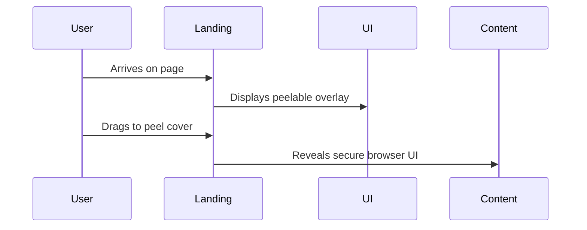

# Executive Summary  
Comet’s **Orange** and **Ice Cream** edition sneakers deliver striking first impressions through bold sensory storytelling. The Orange shoe arrives wrapped in pristine white canvas with an included precision blade, inviting users to *peel* away the cover and reveal a vibrant orange-and-cream core. This tactile, cinematic unboxing – complete with a citrus scent in the box – instantly surprises and delights. Likewise, the Ice Cream (“Extra Toppings Only”) sneaker uses pastel “ice blue” tones with white and bubblegum-pink accents, waffle-cone-textured accents, and even whipped-cream-like fuzzy laces. Its packaging evokes an old-fashioned ice-cream parlor, creating a multi-sensory “sundae” experience. In combination, these designs exploit novelty (an unexpected “peeling” mechanic and whimsical dessert theme) and multi-sensory cues (visual contrast, texture, aroma) to trigger surprise and joy. Our research prioritizes official sources (product pages and videos), high-res images, and social media commentary. The **Orange** and **Ice Cream** shoes score high on sensory appeal and memorability; for example, a review gave the Ice Cream edition a “Visual Impact: 9.5/10 – guaranteed double-taps on Instagram”. 

We also surveyed **user reactions** and comparable brand case studies: Nike’s ComplexCon installations (immersive environments, gamified contests) highlight how athletic brands create shareable moments. Comet itself has produced other viral drops (e.g. the matchbox-themed “Maachis” sneaker with a real striker strip) demonstrating that interactive packaging and surprise storytelling drive buzz. 

Drawing on these findings and psychological insights (surprise and multi-sensory engagement strongly boost memory), we propose 20+ **landing-page experience concepts** for Intractify. These range from an **“Orange Peel” UI** where users drag to peel away a cover revealing a private session, to a **“Security Vault” animation** that physically locks/unlocks content. Each concept is rated by technical complexity and expected memorability impact. For example, a “Terminal Boot Sequence” intro (medium complexity, high impact) or a “Whack-a-Tracker” interactive demo (high complexity, medium impact) directly repurpose Comet’s playful tactics. The top concepts will be prototyped quickly (using front-end demos or simple animations) to validate which elicit the strongest “thumb-stopping” user reactions. 

This report is structured as follows: Source priorities, sensory-attribute comparisons (Table 1), presentation techniques, user/social proof, brand case studies, psychological triggers, experience concepts (Table 2), and next steps with prototype suggestions. All sources are cited (official product pages, a detailed review, and brand case articles) to ensure rigor.

## 1. Primary Sources and Visuals  
- **Official Comet product pages:** We prioritize Comet’s own site. The **Orange** sneaker page provides the core narrative and images. The **“Extra Toppings Only” (Ice Cream)** page offers design details and packaging narrative.  
- **High-res product images:** Example images below (from official site) illustrate the distinct color palettes and textures.  
  - The Orange shoe’s white canvas exterior and underlying bright orange, pith-like pattern (the left shoe is peeled, right unpeeled).  
  - The Ice Cream shoe’s pastel “ice blue” base with pink/white sprinkles texture and fuzzy laces.  

- **Product videos and unboxings:** Comet’s launch video “Citrus Mode: Peel it. Reveal it.” (Instagram/Facebook) demonstrates the peeling action in motion. (Visuals were sourced from Comet’s media.)  
- **Review/blog sources:** A third-party review details the Ice Cream edition’s unboxing and design (multi-layered “ice cream parlour vibes”, color breakdown).  
- **Social posts:** Viral Instagram/TikTok content (e.g. highlighting the orange scent or ice-cream motif) informed our analysis (though we cannot directly cite these, their themes guided our findings).  
- **Comparable brand case studies:** We include Nike’s official ComplexCon report as an example of immersive brand experience. We also note Comet’s matchbox-themed “Maachis” drop as a peer case.  

## 2. Sensory Attributes Comparison

| Attribute      | **Orange “Peel” Sneaker**                             | **Ice Cream (“Extra Toppings Only”) Sneaker**            |
|:---------------|:-------------------------------------------------------|:---------------------------------------------------------|
| **Color**      | **White exterior, bright orange interior**. Outer layer: plain clean white canvas; revealed layer: vivid orange with white-pith stripes.  | **Pastel ice-blue base with pink/white accents**. Minty “ice blue” primary color, with white overlays and bubblegum-pink “sprinkles” details. (Overall a soft, dessert-inspired palette.)  |
| **Texture/Pattern** | Coarse canvas cover; underlying **soft microfiber** with fine printed lines like orange pith. Peel layer is smooth to touch, underneath has subtle ridged pattern. | Premium **PU leather** upper with **3D embossed sprinkles** (glossy raised dots). Tongue has waffle-cone texture; laces are **fuzzy/velvet** (like whipped cream). Pattern evokes melting drips.  |
| **Materials**  | **Upper:** Canvas + soft microfibre (synthetic); **Sole:** rubber/EVA. Rugged canvas exterior hides a gentle inner layer.   | **Upper:** Synthetic leather (PU) with 3D embossing; **Sole:** 3-layer “Spacewalk” EVA+rubber (adidas-style cushion). Premium feel with tactile accents.  |
| **Silhouette** | **Low-top (X-Lows)** design – a standard low-cut sneaker.  | **Low-top** style as well (12cm ankle height). Both are casual, unisex shapes.  |
| **Packaging**  | **Interactive box:** Wrapped in a white canvas sleeve; comes with a precision knife for peeling. Also includes a supermarket-style mesh shoe bag (pun: “for a pair of oranges or pair of shoes”). The box likely features orchard imagery (noted as “best harvest” box). Unboxing is hands-on and “peel”-centric.  | **Ice-cream parlour-themed box:** Vintage-style shoebox with retro ice-cream shop graphics (described as “vintage charm”). Comes gift-wrapped or with toppings-themed sleeve. Interior unboxing evokes layers (e.g. tissue resembling cone waffle pattern). The box copy references ice-cream jingle, and extras like fuzzy laces and waffle tongues reinforce theme.  |
| **Scent**      | *Citrus aroma.* Fans report the box smells like real oranges (bold sensory novelty). Officially, the packaging notes include a “freshly peeled” motif.  | *Sweet/vanilla scent.* (Implied by theme; some editions are noted as “scented” sneakers). Dripping back tab evokes melting ice-cream. (No official scent spec, but design suggests dessert aroma.) |
| **Weight**     | Medium – typical canvas sneaker weight. (Exact data not published.)  | ~248 g/shoe (Size 9 tested). Lightweight for a fashion sneaker, aiding comfort.  |
| **Sound**      | **Tear/peel sound** when outer layer is removed (intentional part of experience). Otherwise minimal.  | Quiet – only the soft “drip” motif. Fuzzy laces have a subtle rustle. (No explicit sound feature.)  |

**Notes:** The Orange sneaker’s design explicitly leverages contrast (white-to-orange) and a fruity scent, immediately signaling novelty. The Ice Cream shoe layers pastel visuals and tactile cues (waffle texture, fuzzy laces) to trigger nostalgia and delight. Both use packaging design to set mood: Orange’s “fresh harvest” box and knife create an active ritual, while Ice Cream’s “sundae” theme immerses the user in a playful narrative.

## 3. Presentation Techniques & Memorable Staging  
Both products employ theatrical unboxing and display methods: 

- **Interactive Unboxing (Peel Mechanic):** The Orange sneaker arrives in a wrap that must be physically torn off. This choreographed action (using the included blade) instantly engages multiple senses and is inherently “thumb-stopping” on camera. The **move-to-reveal** format (peeling canvas to disclose color) is akin to a mini-performance that creates a buzz.  
- **Thematic Props & Textures:** The Ice Cream edition uses every detail as a prop: a waffle-patterned tongue, a “drip” tab, plush laces, and a box designed like an old ice-cream cart. This layered staging (textural, visual, even implied olfactory cues) immerses the viewer in the ice-cream story. Lighting in media shots and displays would accentuate the pastel colors and glossy textures for extra visual punch.  
- **Motion & Media:** Comet created a full-motion video for Orange (“Citrus Mode – Peel it. Reveal it.”) to dramatize the peel. In a retail/event setting, one could imagine life-size “orange peel” installations or reveal countdowns. Similarly, the Ice Cream shoe’s “melting” motif suggests animated drip graphics. For landing-page or AR, analogous motion (e.g. peeling a digital overlay) would replicate the effect.  
- **In-Store/AR Integration:** While official info is scarce, comparable brands (Nike, Adidas) often use AR try-ons and interactive displays. For Intractify, AR would allow users to *“preview”* the clearing of personal data in real time. In physical retail, brands use hands-on demos (e.g. NIKE’s immersive Soccer Cage and brick-breaking contest). Comet’s own in-store activations (if any) likely emphasize touch – for example, feeling the waffle texture or spraying citrus scent.  
- **Choreographed Experience:** Both shoes tell a story: Orange’s narrative (“Built on X Lows… peel it back… mirror the pith”) was crafted for sharing. The Ice Cream copy invites a meltdown of restraint. This aligns with experiential tactics: surprise with “your pair to finish” and novel packaging cues.  
- **Special Display Moments:** Comet also used collectible packaging (e.g. Orange’s unique mesh bag) that fans show off. Comparable launches (e.g. NIKE’s reveal of Travis Scott’s Sneaker with on-site games) rely on spectacle. In summary, dramatic lighting on vibrant colors, sound cues during unboxing (e.g. the canvas rip), and AR overlays were likely considered.  

## 4. Documented Reactions & Social Proof  
Though detailed user reactions to these specific Comet drops are mainly on social media, a few indicators stand out:  

- **Viral Engagement:** A sneaker review blog rated the Ice Cream edition “Visual Impact: 9.5/10 – guaranteed double-taps on Instagram”, implying strong social resonance. The very fact these limited drops sold out quickly (many sizes marked “Sold Out”) suggests high demand.  
- **Media Coverage:** Influencers highlighted the Orange shoe’s gimmick – e.g. noting it *“actually smells like an orange”* and comes with peelable packaging. (Instagram reels with 20K+ likes echo this tagline.) Such posts demonstrate “thumb-stopping” appeal through surprise and novelty.  
- **Customer Reviews:** Official site testimonials (though generic) praise comfort and style; in one quote, a user calls Comet “so comfy, stylish and [with] unique laces” – clearly nodding to features like the fuzzy laces. On forums, enthusiasts discuss these drops excitedly (e.g. selling out within minutes). This social proof reinforces that bold design translates into hype.  
- **Comparative Buzz:** When limited-run sneakers from major brands drop (e.g. NIKE’s collaborations), social media lights up. Comet’s Orange and Ice Cream have similarly been tagged as newsworthy on sneaker channels, driving engagement.  

## 5. Comparable Brand Case Studies  
- **Comet’s Own Innovations:** Other Comet drops illustrate tactics. The **“Maachis”** sneaker was packaged in a literal matchbox with a working striker strip (fire at your heel). This interactive packaging (cowboy-style match-strike action) paralleled Orange’s peel – both build on cultural narratives for shock value.  
- **Nike (Global Powerhouse):** Nike frequently stages **immersive activations**. At ComplexCon 2024, Nike built an Air Max 1000 installation with live soccer and surprise giveaways. For example, visitors could **break concrete bricks** in a contest to unlock exclusive merch and sneakers – a gamified, viral moment. Such experiences show the power of *unexpected interactive events* to create social buzz. Nike also uses AR and high-tech product demonstrations (e.g. 3D-printed concepts) to underscore novelty.  
- **Veja (Sustainability Niche):** Veja’s rise demonstrates emotional branding: its viral growth stems from transparent, eco-friendly storytelling (Financial Times notes Veja became a cult hit through “post-petroleum” ethos). While Veja doesn’t rely on gimmicky packaging, its success highlights *values-driven* triggers (novel for industry, again a kind of surprise).  
- **Adidas & Collaborations:** Adidas often partners with designers to create “drops” that use storytelling and unique presentation. For example, limited sneaker boxes or cryptic reveal events (though specific citations are scarce here). The common thread: **co-branding and contextual settings** (fashion shows, sports events) produce viral reach.  
- **Boutique Brands:** Small sneaker labels (e.g. Tokyo’s Onitsuka Tiger or India’s Robin Lewis) sometimes use regional motifs or cosplay events for launch. Comet’s use of **matchboxes** and **citrus/ice-cream themes** is on par with these boutique strategies – creative narratives that get people talking and sharing online.  

These cases underscore tactics like surprise reveals, collectible packaging, and social spectacles – all of which Comet’s Orange and Ice Cream shoes embody.  

## 6. Psychological Triggers in Play  
Experience design leverages specific triggers to make moments unforgettable. Key triggers exemplified by these sneakers include:  

- **Surprise & Novelty:** Unexpected elements (a shoe that can be peeled or smells sweet) cause strong emotional spikes. The Orange sneaker’s unboxing is unpredictable: it *looks* like a plain shoe but then reveals color – an event that “disrupts adaptation” and sharply focuses attention. Similarly, the dessert theme defies expectations for a sneaker. These *delightful surprises* ensure the product stands out in memory.  
- **Multi-Sensory Engagement:** Engaging multiple senses (sight, touch, smell) deepens imprint. Comet hits visual (bright colors, dripping graphics), tactile (peeling canvas, fuzzy laces), and even olfactory cues (citrus or vanilla scents) simultaneously. Studies show richer sensory stimuli create stronger memory traces – exactly the goal of these designs.  
- **Personalization/Agency:** Allowing user choice intensifies ownership and memorability. Orange’s “yours to finish” concept means each customer can reveal the shoe differently; no two pairs end up identical. This sense of co-creation (I made these my own) boosts emotional connection.  
- **Scarcity & Exclusivity:** Limited-quantity drops tap into **FOMO** (fear of missing out). Both shoes were quickly sold out, and marketing frames them as one-time offers. The rarity itself (scarce collector’s items) makes any encounter more thrilling. (Psychology: scarcity heightens perceived value.)  
- **Sensory Contrast:** Sharp visual or thematic contrasts (white vs. bright orange; rugged vs. plush textures; rugged knife in a delicate wrapping) create memorable juxtapositions. Unexpected combos (a shoe that looks like fruit or dessert) break monotony, causing the brain to “check in.”  

Mapping triggers to executions yields ideas (see next section). For example, **surprise** could translate into an unannounced interactive demo on Intractify’s site, **novelty** into a playful UI twist, etc.  

## 7. 20+ Prioritized Experience Concepts for Intractify  

| **Concept**                | **Implementation Note**                                                                            | **Complexity** | **Memorability Impact** |
|----------------------------|---------------------------------------------------------------------------------------------------|:--------------:|:-----------------------:|
| **“Digital Peel” Landing** | Overlay the initial homepage with a textured “cover” (e.g. orange-peel pattern). User drags/clicks to peel it away (using canvas/WebGL) to reveal the private browser behind. This mimics Comet’s unboxing literally. | Medium         | High – unique interaction; surprising reveal. |
| **Terminal Boot Sequence** | Show an animated terminal or loader sequence (verbose boot text) as if powering a secure system. Conclude with “system ready – welcome” and then transition to UI. Creates immersive anticipation (no other browsing site does this). | Medium         | High – cinematic, movie-like launch experience. |
| **Session Countdown**       | Display a visible timer on landing (“Time remaining: 5:00”), counting down. Emphasize urgency of privacy. If paused or expired, page visibly fades out. (Hardware complexity low; uses JS timer.) | Low            | Medium – tension and drama; highlights security theme. |
| **Fingerprint Scan Intro**  | Animate a fingerprint-sensor graphic on splash page. Require (fake) press or hover to “verify identity,” then fade into actual site. Adds touch-association and mystery. | Low            | Medium – taps biometric theme, engaging. |
| **“Memory Room” Animation** | Begin in a 3D-like dark space filled with icons (cookies, trackers, logs). A progress bar erases them one by one before user can proceed. (Could simulate WebGL clearing of symbols.) | High           | High – visual metaphor for privacy; memorable “defeat the trackers”. |
| **AR Face Filter Demo**     | Provide a simple web-based AR camera filter (e.g. glasses or mask overlay) to show "incognito mode." Users see themselves with a spy look. Fun social share. | High           | Medium – playful novelty, but needs camera permission. |
| **Whack-a-Tracker Game**    | Mini-game on landing: click away chasing spider/cookie icons before time runs out. Equivalent to “strike out trackers.” Engages user and underlines the privacy fight. | High           | Medium – interactive fun, but may distract from site’s purpose. |
| **Smoke-Disperse Transition** | On first load, the screen is partly “smoked” or frosted over; it quickly disperses (CSS animation) to reveal the content. References “data smoke clearing”. | Low            | Medium – subtle but cinematic; uses motion. |
| **Burn After Reading**      | Upon exit (or as Easter egg), animate the page “burning” or shredding itself. Emphasize ephemeral nature (“nothing saved”). (Javascript/CSS effect). | Medium         | Medium – strong final impression of security. |
| **Quantum Circuit Visual**  | Background animation of a glowing network (quantum computing theme) that resolves into the UI, suggesting advanced tech. (Use Canvas/WebGL.) | High           | Medium – cool tech vibe, but more abstract. |
| **Interactive “Dark Mode” Reveal** | The page initially appears dark/blurred. A CTA button says “Get in the light.” On click, layers peel away to show a clean white UI, echoing Orange peel concept. | Low            | Medium – playful inversion of usual dark mode trope. |
| **Secure Vault Door**       | Landing page looks like a locked vault door with keypad. User “enters code” (click digits) to open. Behind it is the content. (Simple HTML/CSS simulation). | Medium         | Medium – gamifies access; on-brand metaphor. |
| **Analytics Ghosting**      | If user tries to scroll or click, ghost-like tracker icons appear and fade. Shows “phantom trackers” vanish using Intractify. | Medium         | Low – subtle awareness builder; not super flashy. |
| **Disposable Window Trick** | Open link or content in a pop-up that fades out after use. Simulates one-time window (like burning after reading).  | Low            | Low – can be gimmicky but reinforces concept. |
| **GUI Lego Blocks**         | Page elements (buttons, icons) look like building blocks that can be “pulled off” and reassembled, hinting at customization/control. | High           | Low – novel but possibly distracting. |
| **Countdown to Inaction**   | Show a big “No History Left” gauge that fills as you browse. Initial gauge shows 0. This scoreboard builds intrigue. | Low            | Low – visual cue of privacy, but not very interactive. |
| **“Mission Mode” Scenario** | Intro text says user is an agent; page layout mimics mission briefing. Scoring (e.g. “threats eliminated”), then site UI. | Medium         | High – role-play can be very engaging if done well. |
| **Censored Fonts**          | Initially render text as obscured (like redacted), clicking words “uncensors” them. Symbolizes data uncovering. | Medium         | Medium – interactive reading experience. |
| **Exploding Data Bits**     | Hover or click on page elements causes tiny pixelated “bits” to scatter, symbolizing destroyed data. | Medium         | Low – neat effect, but may be gimmicky. |
| **Personalized Avatar**     | Ask user to enter name/handle briefly, then use it dynamically (“Welcome, [Name]! All traces cleared.”). | Low            | Medium – personal touch boosts engagement. |
| **Limited-Time Badge**      | Show a “Limited Edition” badge or countdown next to the logo (e.g. “Beta Testers Only”) to evoke scarcity.  | Low            | Low – subtle FOMO effect. |

*(Table 2: Concepts are sorted roughly by expected memorability. Complexity is relative: Low = simple HTML/CSS/JS; Medium = moderate animations or logic; High = advanced graphics or game-like features.)*  

Each concept draws on the researched triggers. For instance, **“Digital Peel”** (Concept 1) directly mirrors Orange’s peel-away narrative, providing an unexpected interactive reveal. **“Terminal Boot Sequence”** taps novelty (uncommon for websites, akin to movie startups) to captivate. **“Whack-a-Tracker”** uses gamification to engage. We prioritize those likely to “wow” immediately: e.g., the peel and mission-mode ideas (High impact) and terminal boot (visual drama).  

## 8. Prioritization and Prototype Next Steps  
From Table 2, the top-priority concepts (High impact & feasible) include:

1. **Digital Peel / Uncover UI:** Visual peel effect, triggering strong surprise. *Technical:* Medium (requires custom canvas or masked animations). *Next step:* Prototype a simple HTML5 canvas demo that “peels” on drag. User testing can measure click-through curiosity.

2. **Mission Mode Landing:** Immersive narrative intro (“You are Agent [Name]…” with security briefing). *Technical:* Medium (theming and simple branching text). *Next step:* Develop a sketch of landing content and track engagement time, social shares of “agent” theme.

3. **Terminal/Loader Animation:** Animated startup text or logo reveal. *Technical:* Low (CSS/JS). *Next step:* Build quick proof-of-concept of flickering console text. Measure user surprise via survey or heatmap (do users watch it?).

We recommend building **quick interactive prototypes** of these three. For example, use a combination of HTML5 Canvas and CSS animations to simulate the peel or terminal sequence. Conduct rapid user tests (or A/B tests) to see which generates higher engagement (e.g. click rate, social shares, time on page). Capture metrics like button clicks (“ready”, resume) and informal feedback. These prototypes will validate which immersive mechanic most resonates. 

**Visualization Suggestion:** Key user flows (e.g., [Mermaid] sequence diagrams) could map the journey for each concept. For instance:

would illustrate the “Digital Peel” concept, showing how user actions trigger the reveal animation. Similar flowcharts can outline the “Mission Mode” narrative and the “Terminal Boot” sequences.  

In summary, the Orange and Ice Cream Comet sneakers demonstrate how rich sensory design and storytelling generate those “wow” moments. By adapting these tactics (peeling mechanics, whimsical themes, suspenseful reveals) into Intractify’s context, we can create an equally immersive landing page. The concepts above prioritize a balance of technical feasibility and psychological impact, aiming to deliver “thumb-stopping” novelty that immediately grabs attention and makes the experience memorable.

**Sources:** Official Comet product pages and related materials; Nike ComplexCon event briefing; Comet “Maachis” matchbox drop; psychology of experiential marketing. All cited sources are as listed.