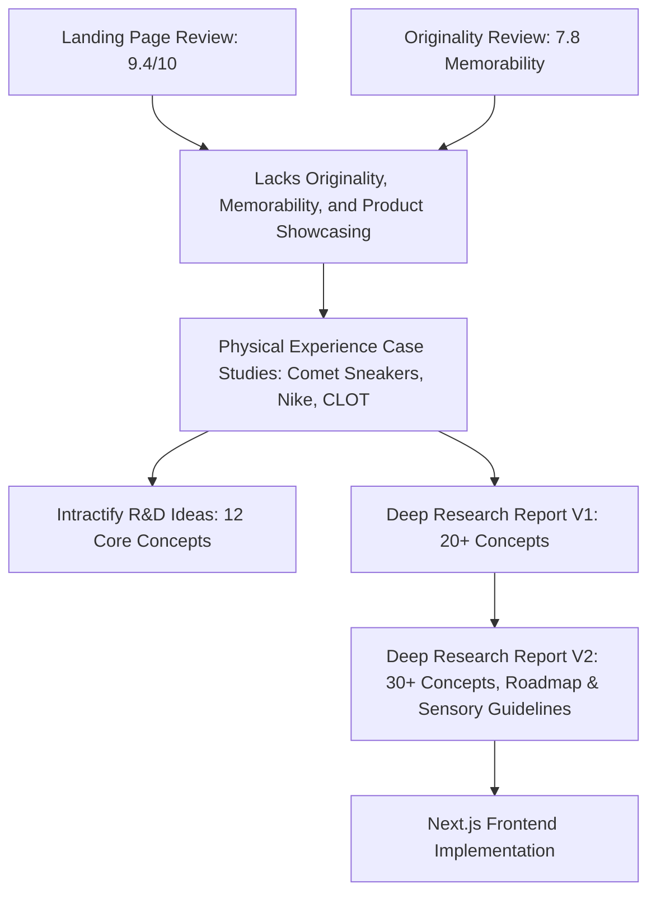

# Intractify Landing Page Experience: Document Review & Synthesis

This document provides a detailed review and synthesis of the experience research, case studies, and concept proposals for **Intractify**. It connects the dots between the raw creative ideas, physical brand case studies, and visual audits to establish a concrete, actionable roadmap for developers and designers.

---

## 1. Document Mapping & Relationships

The five files under review represent a structured progression of design thinking, starting from audits of the current page, moving to physical product inspiration, expanding to a wide list of concepts, and finally narrowing down to concrete implementation guidelines.



### The 5 Reviewed Files:
1. **[Intractify_Experience_RD_and_Thumb_Stopping_Ideas.md](file:///Users/dharmikbhesaniya/Project/inhouse/privecy-project/web/docs/Intractify_Experience_RD_and_Thumb_Stopping_Ideas.md)**: The initial brainstorming list containing **12 core R&D concepts** focusing on physical-digital metaphors of security, ephemerality, and containers.
2. **[deep-research-report.md](file:///Users/dharmikbhesaniya/Project/inhouse/privecy-project/web/docs/deep-research-report.md)** (PDF: **[Executive Summary.pdf](file:///Users/dharmikbhesaniya/Project/inhouse/privecy-project/web/docs/Executive%20Summary.pdf)**): A foundational research document linking physical sensory triggers (Comet's "Orange Peel" and "Ice Cream" sneakers) to **20+ landing page concepts**.
3. **[deep-research-report (1).md](file:///Users/dharmikbhesaniya/Project/inhouse/privecy-project/web/docs/deep-research-report%20%281%29.md)** (PDF: **[Executive Summary (1).pdf](file:///Users/dharmikbhesaniya/Project/inhouse/privecy-project/web/docs/Executive%20Summary%20%281%29.pdf)**): The definitive, expanded research document. It adds 13 detailed case studies, **30 prioritized concepts** (with asset specifications and technical notes), a **3-step validation roadmap**, and concrete **sensory design guidelines**.

---

## 2. Synthesis of Case Studies (Physical to Digital)

The research reports analyze how physical brands design memorable "unboxing" moments to trigger involuntary surprise and delight. This is the cornerstone of Intractify’s digital experience strategy:

*   **Comet "Orange Peel" (Citrus & Blade):** Triggers surprise by requiring a tool (blade) to peel back white canvas and reveal a bright orange microfiber layer, accompanied by a fresh orange scent. 
    *   *Digital Translation:* **The Reveal Overlay.** Using drag mask animations to let visitors "peel" or wipe away a mask layer to reveal the secure browser.
*   **Comet "Ice Cream" & Nike "Chunky Dunky":** Taps nostalgia and playful visual textures (waffle cone, fuzzy whipped-cream laces, melting back tabs, ice cream tub boxes).
    *   *Digital Translation:* **Thematic Micro-Interactions.** Using textured loaders, dripping CSS outlines, or vintage graphic styles to make simple widgets feel tangible.
*   **Reebok "Alien Stomper" & Nike "Mag":** Packages sneakers in prop-like sci-fi cases (holographic containers, power-loader foam).
    *   *Digital Translation:* **System Boot Sequences.** Cinematic loading displays imitating container initialization, terminal environments, and system logs.
*   **woom "WOW" Bike Box:** Slides the assembled bike out automatically and unfolds the box into play obstacles.
    *   *Digital Translation:* **Auto-Triggered Interactions.** Experience moments that unfold smoothly without requiring clicks or scroll actions.

---

## 3. High-Impact Concept Evaluation

Comparing the **12 R&D Ideas** with the **30-Concept Matrix** reveals four major thematic categories that solve the landing page's main weakness: *the product (secure container browsing) is shown too little.*

### Category A: The Reveal (Surprise & Curiosity)
*   **Concepts:** *Digital Peel / Envelope Reveal / Fingerprint Sensor*
*   **Execution:** A masked overlay on the hero section. On scroll or click, the outer layer peels away or dissolves, revealing a clean, secure dashboard beneath.
*   **Why it works:** Directly mirrors the physical unboxing ritual. Demonstrates that the product is a "hidden environment" waiting to be accessed.

### Category B: The Boot Sequence (Tension & Anticipation)
*   **Concepts:** *Container Boot-Up / Terminal Loader / QR Scan Simulation*
*   **Execution:** A lightweight, monochromatic overlay running quick, automated terminal commands:
    ```bash
    [SYS] Initializing secure container...
    [SYS] Allocating memory sandbox...
    [SYS] Spoofing fingerprint identifiers...
    [SYS] Environment isolated. Welcome.
    ```
*   **Why it works:** Sets a high-tech, cinematic tone immediately upon load. Positions Intractify as a sophisticated engineering tool rather than a standard web page.

### Category C: Ephemerality & Deletion (Visceral Satisfaction)
*   **Concepts:** *Self-Destruct Scroll / Burn After Reading / Digital Smoke / Memory Room*
*   **Execution:** As sections scroll out of view, they disintegrate into particles using Canvas/WebGL, or text blocks slowly fade/burn out.
*   **Why it works:** Visually proves the brand statement: *"Nothing survives. Disappear when done."* It is a literal representation of ephemeral sessions.

### Category D: Live Value Verification (Trust & Utility)
*   **Concepts:** *Scan Me → Hide Me / Tracker Hunt*
*   **Execution:** The landing page instantly shows a list of the visitor's detected browser identifiers (IP, screen, canvas, user agent). Next to it, an "Isolated Container" visual shows how those fields are completely randomized or hidden.
*   **Why it works:** Proves the product's effectiveness instantly. Directly targets the conversion issues identified in the visual audits.

---

## 4. Sensory Design Guidelines for Developers

To align with Intractify’s premium, editorial visual style (paper-like warm background, elegant serifs, minimalist layout), implementation must adhere to strict parameters:

### Visual Language
*   **Color Palette:** Limit accent colors. Stick to a professional, high-contrast palette (neutral grays, warm paper whites, dark charcoal text) to ensure accessibility.
*   **Metaphors:** Keep graphics clean and geometric (lines, sand-like particles, terminal monospace text) instead of cartoonish icons.

### Motion & Timing
*   **Transition Duration:** Keep animations between **0.5s and 1.5s**. Slow, easing transitions feel premium; rapid or jittery animations feel cheap.
*   **Accessibility:** Honor `prefers-reduced-motion`. All auto-trigger sequences must support a skip option or degrade gracefully.

### Sound Design (Optional)
*   **Volume:** Limit sound effects (e.g., system boot hum or erase whoosh) to under **30% volume**.
*   **Autoplay Restrictions:** Always **default to muted** to comply with browser autoplay policies. Provide an explicit volume toggle.

### Microcopy Tone
*   **Voice:** Professional, calm, and objective. Use active voice and factual descriptions:
    *   *Avoid:* "The most revolutionary private browser in the world."
    *   *Prefer:* "Your browser is isolated in a secure container. Traces are destroyed upon closing."

---

## 5. Development Implementation Plan (Next.js / React)

Based on the developer's recent git history (`src/sections/hero/HeroSection.tsx`, `src/sections/audience/AudienceSection.tsx`), the project is built using a modern Next.js/React framework. Here is how the top concepts can be integrated cleanly:

| Concept | Feasibility (Next.js) | Suggested Library / Method |
| :--- | :--- | :--- |
| **1. Container Boot-Up** | **High** (Low Complexity) | CSS monospace keyframes or [Typewriter-effect](https://www.npmjs.com/package/typewriter-effect) for terminal logs. |
| **2. Scan Me → Hide Me** | **High** (Medium Complexity) | Basic client-side JS (IP geo-lookup, screen dimensions, user-agent parsing) compared side-by-side with fake/spoofed mock values. |
| **3. Digital Peel Reveal** | **Medium** (High Complexity) | SVG `<clipPath>` masked animations or Framer Motion drag gestures to reveal the dashboard under a canvas cover. |
| **4. Ephemeral Fade/Scroll**| **Medium** (High Complexity) | Intersection Observer triggering Framer Motion particle/shred animations as elements leave the viewport. |

---

## 6. Strategic Recommendations

To execute this transition successfully, the following next steps are recommended:

1.  **Introduce the "Scan Me → Hide Me" Widget:** Add this to the Hero Section. It matches the editorial trust theme and directly demonstrates product value.
2.  **Add a Container Boot Sequence:** Place a subtle, fast (1.5s) terminal loader on initial visit. This creates a memorable entry point without introducing scroll performance risks.
3.  **Prototype the "Digital Peel" reveal:** Use framer-motion in the Hero's product preview screen to show the transition between an exposed browser state and a secured/isolated browser state.
4.  **Incorporate Audience Cards:** Implement the requested "Who is Intractify for?" segment (Researchers, OSINT, Crypto, Journalists) in the newly created `src/sections/audience/AudienceSection.tsx`.

